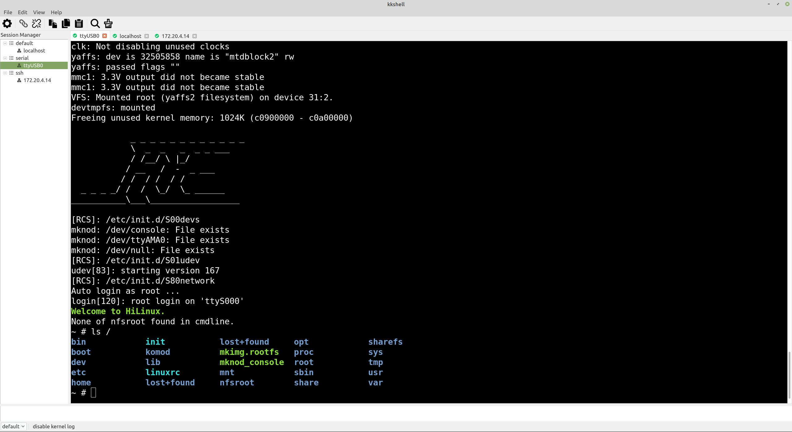

# kkshell
类似 xshell & SecureCRT 的终端管理工具，目前只支持 Linux 系统。
支持协议：串口，ssh，local-shell

已实现特性：
- 会话管理
- 多标签
- 日记保存
- Button Bar
- Command Window

TODO：
- 日志保存改进：添加指定格式的日期前缀，日志分片保存
- Xmodem、Ymodem、Zmodem 等文件传输协议支持
- 提供 Lua api，用户可以编写运行 Lua 脚本
- 使用 libssh2 替代 expect zssh 登录脚本




## 安装依赖
ubuntu 系列的系统：
```
sudo apt install -y git build-essential cmake libqt5serialport5-dev libutf8proc-dev lxqt-build-tools expect zssh
```

## 编译运行
```
git clone https://github.com/qiushao/kkshell.git
cd kkshell
mkdir build
cd build
cmake ..
make -j
sudo make install
```
然后就可以从应用列表里面启动 kkshell 了

## 感谢以下开源项目
- [QT](https://www.qt.io)
- [qtermwidget](https://github.com/lxqt/qtermwidget)
